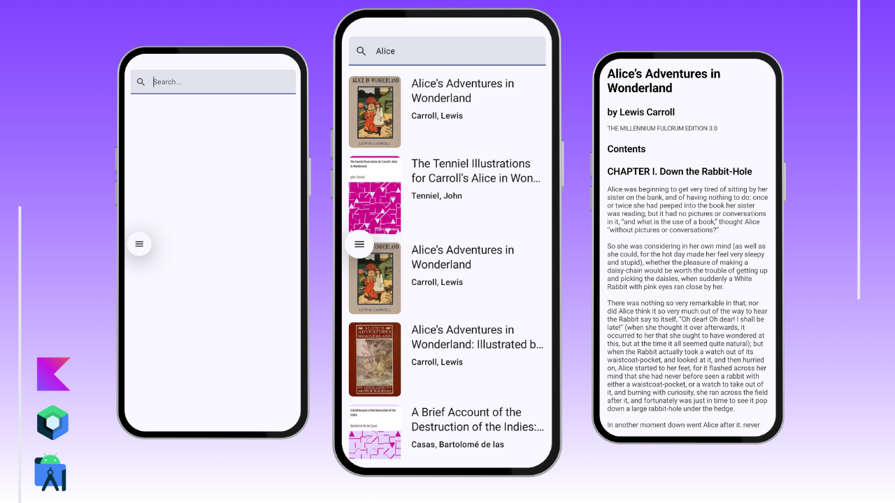

## ✨ Book Reader - Clean Architeture using MVVM

  

## 📖 About
This project uses the [Gutenberg Project](https://www.gutenberg.org/) to fetch data from books.

I made this project while following a course. I've learned a lot from it, including essential concepts, 
such as:
- Hilt/Dagger (Dependency Injection)
- Coil (Image loading)
- Ktor (API requests)
- Navigation
- Jsoup (handle html)
